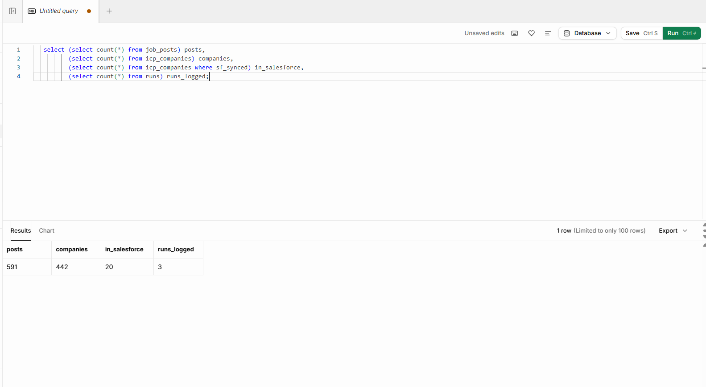
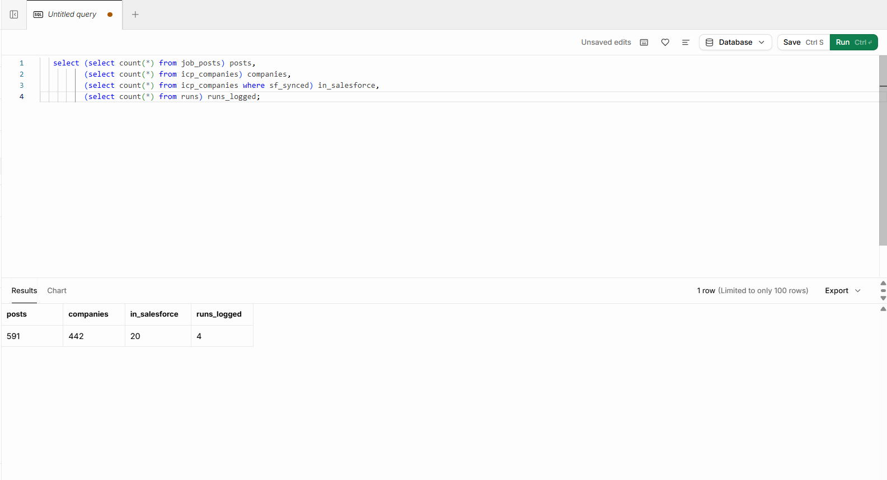
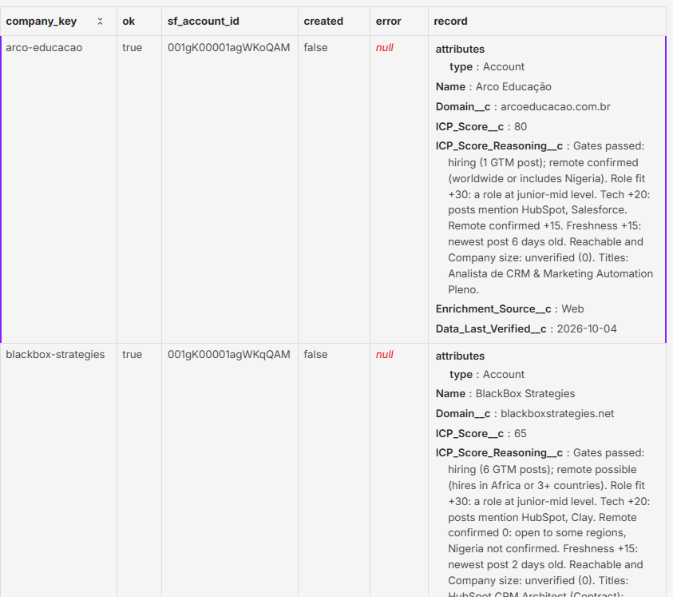

# GTM ICP Engine (P1)

An n8n pipeline that finds companies hiring for GTM roles, scores them against a weighted Ideal Customer Profile, and upserts the qualified ones into Salesforce, with the reasoning behind every score.

Built on a $0 stack: **n8n**, **Supabase (Postgres)**, **Salesforce Developer Edition**, free job-board APIs and Clearbit's free company autocomplete.

## Results (first full run, 2–4 Oct 2026)

| Stage | Count |
|---|---|
| Job posts scanned | 2,114 |
| GTM-type posts kept (last 30 days) | 591 |
| Companies | 442 |
| Passed the remote gate | 40 |
| Scored 50+ | 30 |
| High-confidence domain, upserted to Salesforce | 20 |
| Duplicates created on re-run | **0** (17 updated, 3 new) |
| Wrong domains reaching Salesforce | 4 → **0** after adding a confidence gate |
| Failures recovered automatically on re-run | 42 of 45 |
| Cost | $0 |

Finding: of 442 companies advertising "remote" GTM roles, about 3% were open to a candidate in Nigeria. Most "remote" roles mean remote within the US.

### Re-run proof

Ran the pipeline twice. Record counts were identical; only the run log grew.

| | job_posts | icp_companies | in Salesforce | runs logged |
|---|---|---|---|---|
| Run A | 591 | 442 | 20 | 3 |
| Run B | 591 | 442 | 20 | 4 |

Salesforce returned `created: false` for existing accounts (updated, not duplicated).





## Architecture

```
Part 1  Job boards (Himalayas search API, RemoteOK, Remotive)
          -> normalise to one shape -> GTM title filter + last 30 days (hiring gate)
          -> skip posts already saved -> job_posts

        company_rollup (SQL view): posts grouped per company
          -> roles, countries, latest post, tech mentioned, role fit

Part 2  companies_to_enrich (view: only companies not yet looked up)
          -> Clearbit autocomplete (1 req/sec) -> strict name match
          -> domain + domain_confidence (high | review) -> icp_companies (upsert)
          -> any error -> dead_letter

Part 3  companies_to_score (view)
          -> score with ICP v2 + written reasoning -> icp_companies (bulk upsert)
          -> keep gate passed, score >= 50, high-confidence domain
          -> batches of 200 -> Salesforce Composite API upsert on Domain__c
          -> sync status back to Supabase, failures -> dead_letter, run summary -> runs
```

## ICP v2 scoring

**Gates** (fail = score 0):
- **Hiring:** posted a GTM / RevOps / Marketing Ops / Sales Ops / Growth Ops / CRM role in the last 30 days.
- **Remote:** open worldwide or includes Nigeria (*confirmed*), or hires in Africa or 3+ countries (*possible*). Single-country roles fail.

**Weights** (100):

| Dimension | Points | Why |
|---|---|---|
| Role fit (junior–mid, not Director/VP/Head) | 30 | The best company is useless if the role is a level I can't get. |
| Tech signal (HubSpot, Salesforce, Clay, Apollo, Outreach) | 20 | Skills apply on day one. |
| Remote confirmed | 15 | "Possible" isn't "confirmed". |
| Freshness (posted in last 7 days) | 15 | Fewer applicants; proves the post is real. |
| Reachable (verified contact) | 10 | Not yet measured (unverified = 0). |
| Company size 20–500 | 10 | Not yet measured (no free source). |

Every company gets a reasoning string, for example:
> Gates passed: hiring (1 GTM post); remote confirmed. Role fit +30. Tech +20: posts mention HubSpot, Salesforce. Remote confirmed +15. Freshness +15: newest post 2 days old. Reachable and Company size: unverified (0).

## Design decisions

- **Idempotent by design.** Posts are keyed by `(source, source_job_id)`, companies by `company_key`, and Salesforce accounts are upserted on the `Domain__c` External ID. Re-running never creates duplicates.
- **Work-queue views.** `companies_to_enrich` lists only unfinished companies, so a re-run after a failure retries just the failures.
- **Dead-letter queue.** Every failing node routes to `dead_letter` with the error and payload instead of stopping the run.
- **Human in the loop for data quality.** Domains whose spelling doesn't match the company name are marked `review` and kept out of Salesforce until checked.
- **Supabase holds everything; Salesforce holds only qualified accounts,** to respect Salesforce storage and API limits.

## What didn't work (and what replaced it)

| Tried | Problem | Replaced with |
|---|---|---|
| Apollo company search API | Paid-only on the free plan | Job-board APIs, which also gave better hiring signals |
| RemoteOK + Remotive feeds | Only ~100 and 17 recent jobs; 0 GTM roles | Himalayas search API (591 GTM posts) |
| Himalayas company pages for domain/size | Blocked by Cloudflare bot protection (not bypassed) | Clearbit free autocomplete for domains |
| Loose "starts-with" name matching | 4 wrong domains reached Salesforce | Strict match + `domain_confidence` gate |

## Run it yourself

1. Create a Supabase project and run `sql/schema.sql`.
2. In Salesforce, add Account fields `Domain__c` (Text, External ID, Unique), `ICP_Score__c` (Number), `ICP_Score_Reasoning__c` (Long Text), `Enrichment_Source__c` (Picklist incl. `Web`), `Data_Last_Verified__c` (Date).
3. Import the three workflows from `workflows/` into n8n. Connect a Supabase credential (service role) and a Salesforce JWT credential, and replace the Supabase project URL and Salesforce instance URL in the HTTP nodes.
4. Run Part 1, then Part 2, then Part 3.

## Data sources and credits

Job data from [Himalayas](https://himalayas.app), [Remote OK](https://remoteok.com) and [Remotive](https://remotive.com). Company domains from Clearbit's public autocomplete. This repository contains no scraped job data, only the pipeline.
